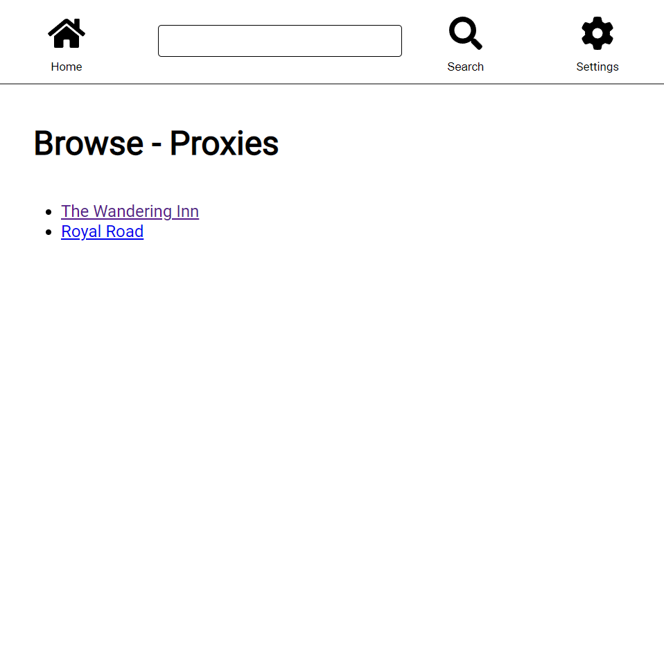
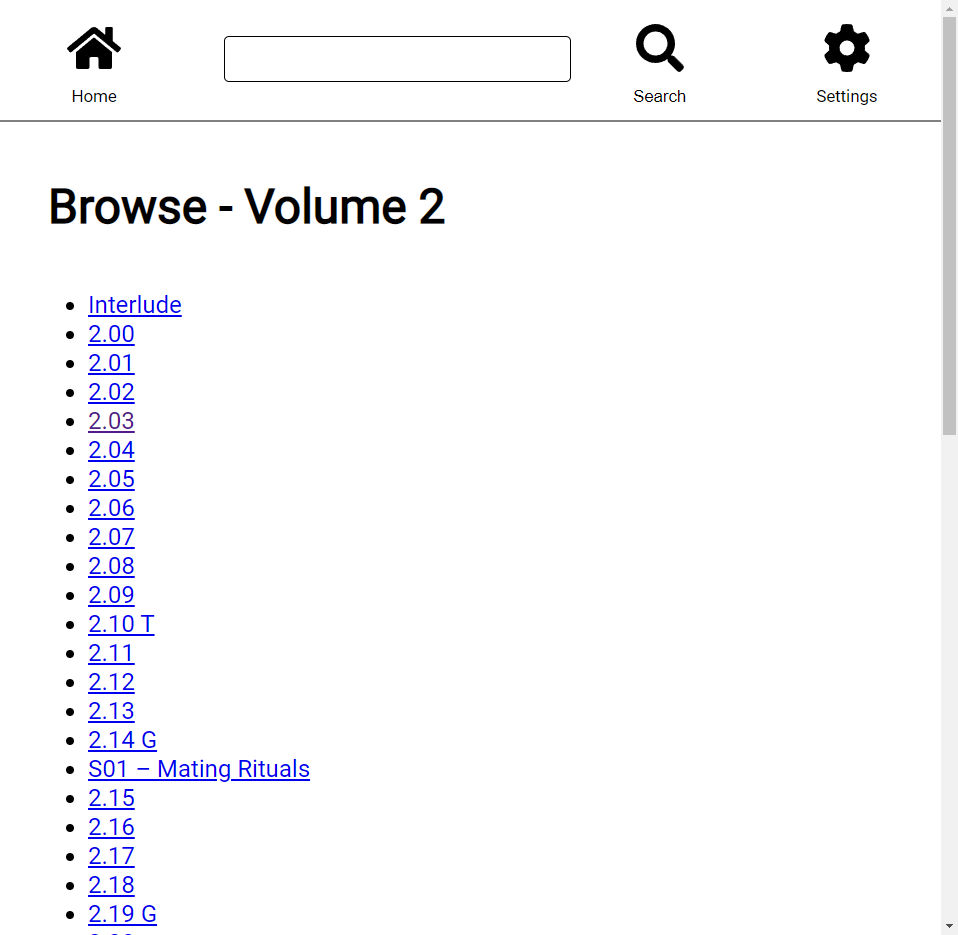
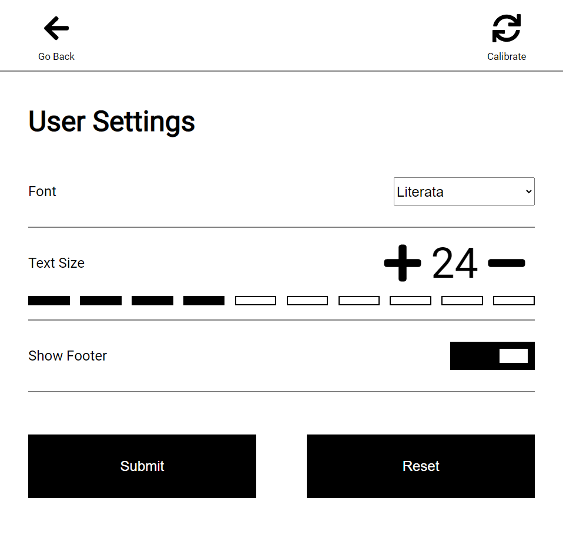
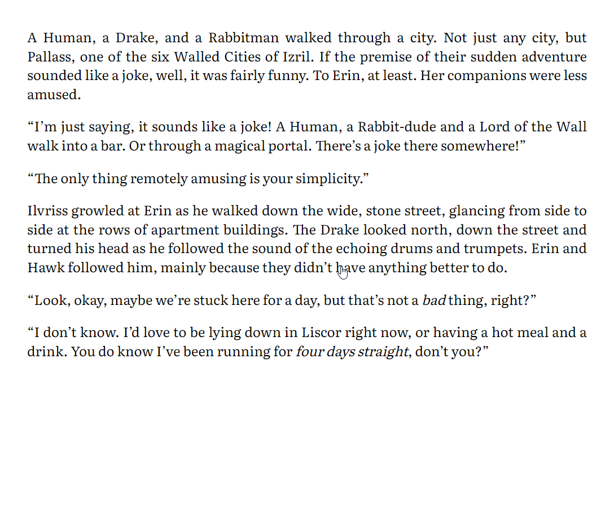

# Kindle Proxy

This application proxies different web novel pages and renders them in a Kindle friendly web page.

## Supported Pages

 - [Royal Road](https://www.royalroad.com/)
 - [The Wandering Inn](https://wanderinginn.com/)

## Tested Devices

 - Kindle Paperwhite 2
 - Kindle Paperwhite (11th generation)

Here is a guide to identify which kindle you own: https://www.androidauthority.com/which-kindle-model-do-i-have-1073996/

# Running it yourself

To run the Kindle Proxy it is recommended to use the provided docker images.
Images are currently published to the GitHub package registry.

## Environment Variables

These variables can be set to configure your setup.

| Variable                   | Default Value                           | Description                                                                                                                                                                                                                                           |
|----------------------------|-----------------------------------------|-------------------------------------------------------------------------------------------------------------------------------------------------------------------------------------------------------------------------------------------------------|
| ROYAL_ROAD_PROFILE         | Empty                                   | Set this to your Royal Road public profile id (can be found in the url) to show only your favorite items in the book overview. When it is left blank only the 'Best Rated' books are listed since Royal Road has too much content to list everything. |
| SETTINGS_DEFAULT_FONT_SIZE | 24                                      | Set this to overwrite the default font size. This value needs to be part of the font size scale. This is an integer value in Pixel.                                                                                                                   |
| SETTINGS_FONT_SIZE_SCALE   | 12, 16, 20, 24, 28, 32, 36, 40, 44, 48  | Set this to overwrite the default font size scale in the settings. Needs to be exactly 10 integer entries split by commas (,).                                                                                                                        |

## Examples

Below are a few simple examples to run the service using docker.

### docker compose

```
version: "3.9"
services:
  kindle-proxy:
    image: ghcr.io/kaiser-chris/kindle-proxy:latest
    ports:
      - 80:80
```

### docker run

```
docker run -d -p 80:80 ghcr.io/kaiser-chris/kindle-proxy:latest
```

# Screenshots
|                   Home Page                    |                            Chapter list                            |                  Settings page                   |
|:----------------------------------------------:|:------------------------------------------------------------------:|:------------------------------------------------:|
|        |                |  |
|                  Content page                  |                    Content page with menu open                     |                                                  |
|  |  |                                                  |

# Image Attribution

 - [Home Icon](/src/main/resources/static/img/home-solid.svg) by [Font Awesome](https://fontawesome.com/license)
 - [Gear Icon](/src/main/resources/static/img/gear-solid.svg) by [Font Awesome](https://fontawesome.com/license)
 - [Arrow Left](/src/main/resources/static/img/arrow-left-solid.svg) by [Font Awesome](https://fontawesome.com/license)
 - [Arrow Right](/src/main/resources/static/img/arrow-right-solid.svg) by [Font Awesome](https://fontawesome.com/license)
 - [Sync Icon](/src/main/resources/static/img/sync-solid.svg) by [Font Awesome](https://fontawesome.com/license)
 - [List Icon](/src/main/resources/static/img/list-solid.svg) by [Font Awesome](https://fontawesome.com/license)
 - [Search Icon](/src/main/resources/static/img/search-solid.svg) by [Font Awesome](https://fontawesome.com/license)